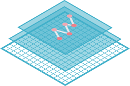
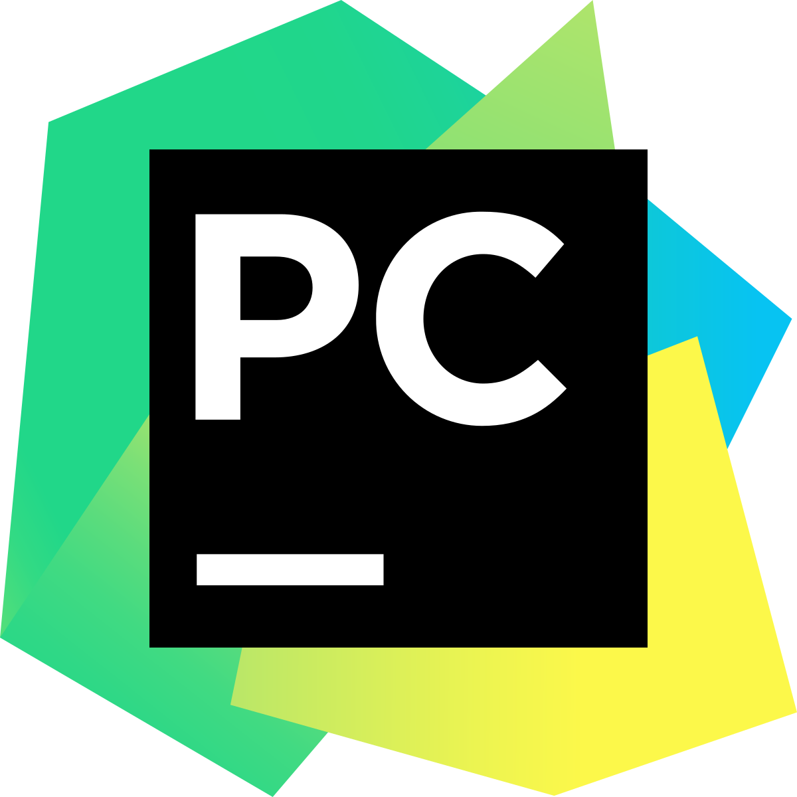
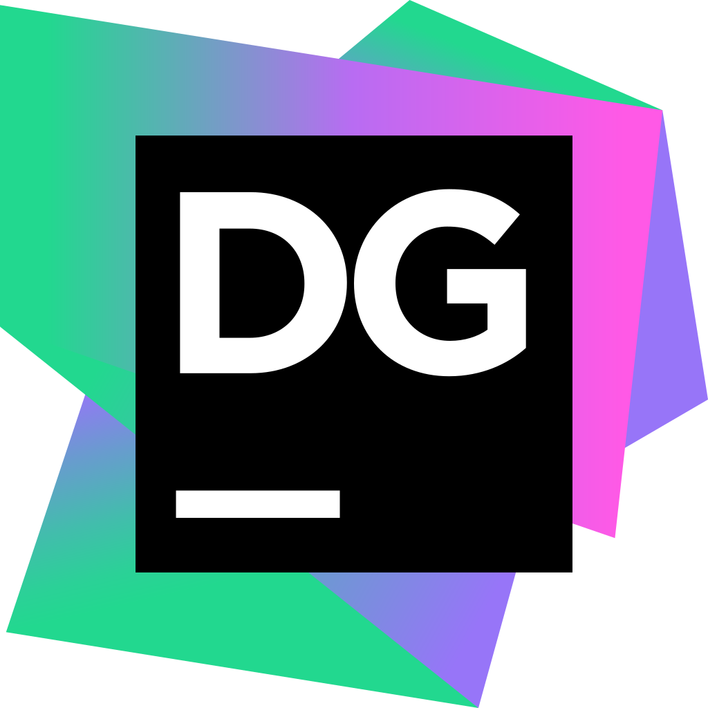

### Hey there 👋

I'm Milk, used to be an experimental biology student, now working on bioinformatics.

#### About me

🎒 Working on my Ph.D.

📦 Developing tools🛠 and methods🔌 for analyzing spatial single-cell data.

💬 Contact:

**Tools developed by me**

 

**The languages I used**

   

**Tools or frameworks**

   

**IDEs and Design software**

      
